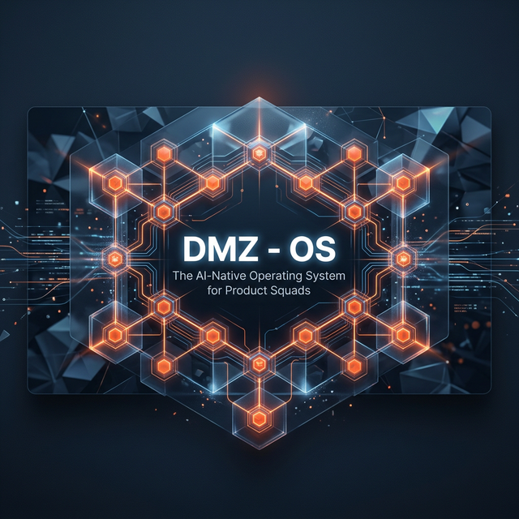
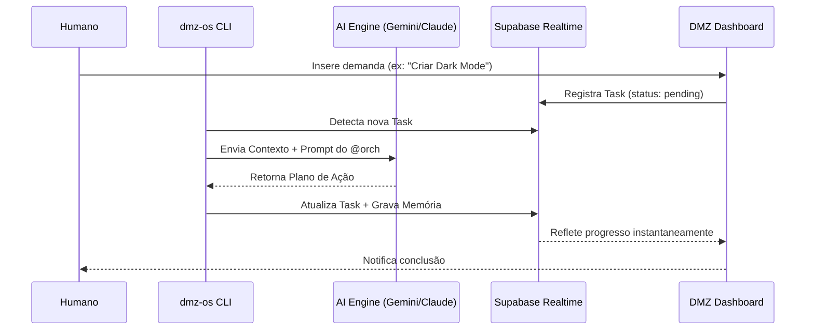

<div align="center">



# DMZ - OS Agents
**The AI-Native Operating System for Modern Product Squads**

[](https://dmz-os.netlify.app)
[](https://dmz-agents-production.up.railway.app)
[](https://supabase.com)
[](https://pypi.org/project/dmz-os/)
[](./LICENSE)

---

### 🔥 Instalação Instantânea
```bash
curl -fsSL https://raw.githubusercontent.com/eldanielsantos-git/dmz-agents/main/install.sh | bash
```

</div>

---

## 🚀 A Visão: AI-Native Organization
O **DMZ - OS Agents** não é apenas uma coleção de chatbots. É uma camada de infraestrutura que transforma seu repositório em uma entidade viva. 

Imagine um squad de **18 especialistas** que não apenas escrevem código, mas gerenciam o backlog, auditam a segurança, garantem a experiência do usuário (UX) e extraem SOPs (Standard Operating Procedures) automaticamente enquanto você trabalha. 

### Por que DMZ - OS?
- **Hierarquia Real:** Agentes operam em níveis de reporte claros, evitando ruído e alucinações cruzadas.
- **Memória de Longo Prazo:** Cada decisão e raciocínio é persistido no Supabase, criando uma base de conhecimento eterna do projeto.
- **Rastreabilidade Total:** Acompanhe cada "pensamento" do `@orch` (Orchestrator Master) através do Dashboard em tempo real.
- **Integração Profunda:** Funciona via CLI diretamente no seu repositório, lendo seu código e contexto atual.

---

## ✨ Funcionalidades Core

| Feature | Descrição |
|---|---|
| **Orchestration** | O `@orch` master planifica demandas complexas e delega para sub-operadores. |
| **Multi-LLM Engine** | Suporte nativo a **Claude 3.7**, **GPT-4o** e **Gemini 2.5 Pro** com fallback automático. |
| **Interactive CLI** | Gerencie seu squad via terminal com comandos como `dmz-os start`, `status` e `tasks`. |
| **Real-time Dashboard** | Visualização completa de Master Plan, Checklist e Work History. |
| **Knowledge Persistence** | Sistema de memória vetorial e relacional integrada via Supabase. |

---

## 🛠️ Guia de Início Rápido

### 1. Instalação via CLI (Recomendado)
A forma mais rápida de injetar o squad em qualquer projeto:

```bash
# 1. Instale o pacote globalmente
pip install dmz-os

# 2. Inicie o setup interativo (Wizard)
dmz-os install
```

### 2. O Loop de Trabalho
Uma vez configurado, seu squad entra em modo de escuta:

```bash
# Inicia os motores e o loop do Orchestrator
dmz-os start
```

O `@orch` agora está vigiando seu projeto. Você pode enviar demandas através do [Dashboard Offline](https://dmz-os.netlify.app/projects) ou diretamente via Supabase.

---

## 🤖 O Squad Especializado
18 agentes organizados para cobrir 100% do ciclo de vida de um produto:

```mermaid
graph TD
    ORCH[@orch Orchestrator Master] --> SYD[@syd Squad Manager]
    ORCH --> JOSE[@jose Project Manager]
    JOSE --> LUCAS[@lucas Product Owner]
    JOSE --> DAVID[@david Scrum Master]
    ORCH --> RYAN[@ryan Developer]
    RYAN --> OLIVER[@oliver DevOps Engineer]
    RYAN --> ALEX[@alex Tech Architect]
    ORCH --> EMMA[@emma QA Engineer]
    ORCH --> CONST[@constantine Cyber Chief]
    CONST --> THERON[@theron Legal Chief]
    ORCH --> AURORA[@aurora Design Chief]
    AURORA --> VICT[@victoria UX Designer]
    ORCH --> CASS[@cassandra Copy Chief]
    ORCH --> KANYA[@kanya Strategy Analyst]
    ORCH --> MART[@martin SOP Extractor]
    ORCH --> SOFIA[@sofia DB Sage]
    ORCH --> QUANT[@quantum Tools Orch]
```

---

## 🏗️ Arquitetura de Dados



---

## 💻 Tech Stack

- **Frontend:** Next.js 15 (App Router), TypeScript, Lucide Icons.
- **Backend/Engine:** Python 3.12, Typer, Rich, Supabase Python SDK.
- **Inteligência:** Google Gemini 2.5 Pro, Anthropic Claude 3.7, OpenAI SDKs.
- **Infra:** Supabase (DB/Auth), Netlify (UI), Railway (Microservices).

---

## 🗺️ Roadmap v0.2.0

- [x] **v0.1.0:** Lançamento do Dashboard e Schema Supabase.
- [x] **v0.2.0:** Engine Python Core + Publicação no PyPI (`dmz-os`).
- [ ] **v0.3.0:** Suporte a Callbacks de Webhooks e MCP Tools dinâmicas.
- [ ] **v0.4.0:** Integração nativa com Cursor e VS Code Extension.
- [ ] **v0.5.0:** Sistema de Governança de Tokens e Custos por Agente.

---

## 🤝 Contribuição e Comunidade
O DMZ OS é um projeto "Dogfooding". Nós usamos os agentes para construir os próprios agentes. Se você encontrar bugs ou tiver sugestões de prompts de especialistas, abra uma Issue!

MIT © 2024 DMZ Labs.
**Make your code alive.**
